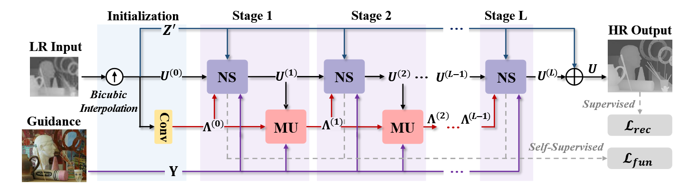

# SNUM-Net

The official pytorch implementation of the paper:

[Deep Semi-smooth Newton-driven Unfolding Network for Multi-modal Image Super-Resolution (TIP, 2025)](https://ieeexplore.ieee.org/document/11222911)

**Chenxiao Zhang**, **Xin Deng** **Jingyi Xu**, **Yongxuan Dou**, **Mai Xu**



:star: If SNUM-Net is helpful to your projects, please help star this repo. Thanks! :hugs:

## News
- **2025.10.22**: Manuscript accepted.
- **2025.10.27**: Release the project code.


## Demo on Multi-modal Image Super-resolution
Please refer to our [paper](https://ieeexplore.ieee.org/document/11222911) for details.

Our method won the fourth place in the [CVPR PBVS 2025](https://pbvs-workshop.github.io/challenge.html) Thermal Image Super-Resolution challenge (GTISRc) - Track2 scale x8. ([View the results](https://codalab.lisn.upsaclay.fr/competitions/21248#results))

## Dependencies and Installation
- CUDA == 12.8
- Pytorch == 2.0.1
```
# git clone this repository
git clone git@github.com:pandazcx/SNUM-Net.git
cd SNUM-Net

# Create a conda environment and activate it
conda env create --file environment.yaml
conda activate snumnet
```

## Examples

[Download the pretrained models](https://drive.google.com/drive/folders/185gz32EafmPZGF2ap2Pl-Xc59KNkP5H9?usp=sharing) and place them in the corresponding subfolder within the `weights` directory.

### 1. Train
#### 1.1 RGB Guided Depth Image Super-Resolution
Modify the paths and scale to the training and testing datasets in the `GDSR/config.yml`

- Train from scratch
```
cd GDSR
python main.py -r 
```
- Finetune
```
cd GDSR
# real-scene
python main.py -r -p /mnt/hdd0/zhangcx/SNUM-Net-main/weights/GDSR/Real
# x4 SR
python main.py -r -p /mnt/hdd0/zhangcx/SNUM-Net-main/weights/GDSR/x4
# x8 SR
python main.py -r -p /mnt/hdd0/zhangcx/SNUM-Net-main/weights/GDSR/x8
# x16 SR
python main.py -r -p /mnt/hdd0/zhangcx/SNUM-Net-main/weights/GDSR/x16
```

#### 1.2 Multispectral Image Pan-sharpening
Modify the paths and satellite datasets to the training and testing datasets in the `Pansharpening/config.yml`

- Train from scratch
```
cd Pansharpening
python main.py -r 
```
- Finetune
```
cd Pansharpening
# GF2
python main.py -r -p /mnt/hdd0/zhangcx/SNUM-Net-main/weights/Pansharpening/GF2
# QB
python main.py -r -p /mnt/hdd0/zhangcx/SNUM-Net-main/weights/Pansharpening/QB
# WV3 and WV2
python main.py -r -p /mnt/hdd0/zhangcx/SNUM-Net-main/weights/Pansharpening/WV3
```

#### 1.3 RGB Guided Thermal Image Super-Resolution
Modify the paths and scale to the training and testing datasets in the `GTSR/config.yml`

- Train from scratch
```
cd GTSR
python main.py -r 
```
- Finetune
```
cd GTSR
# x8 SR
python main.py -r -p /mnt/hdd0/zhangcx/SNUM-Net-main/weights/GTSR/x8
# x16 SR
python main.py -r -p /mnt/hdd0/zhangcx/SNUM-Net-main/weights/GTSR/x16
```

### 2. Test
#### 2.1 RGB Guided Depth Image Super-Resolution
- Test on the testset
```
cd GDSR
# real-scene
python main.py -r -m test -p /mnt/hdd0/zhangcx/SNUM-Net-main/weights/GDSR/Real
# x4 SR
python main.py -r -m test -p /mnt/hdd0/zhangcx/SNUM-Net-main/weights/GDSR/x4
# x8 SR
python main.py -r -m test -p /mnt/hdd0/zhangcx/SNUM-Net-main/weights/GDSR/x8
# x16 SR
python main.py -r -m test -p /mnt/hdd0/zhangcx/SNUM-Net-main/weights/GDSR/x16
```


#### 2.2 Multispectral Image Pan-sharpening
- Test on the testset
```
cd Pansharpening
# GF2
python main.py -r -m test -p /mnt/hdd0/zhangcx/SNUM-Net-main/weights/Pansharpening/GF2
# QB
python main.py -r -m test -p /mnt/hdd0/zhangcx/SNUM-Net-main/weights/Pansharpening/QB
# WV3 and WV2
python main.py -r -m test -p /mnt/hdd0/zhangcx/SNUM-Net-main/weights/Pansharpening/WV3
```

#### 2.3 RGB Guided Thermal Image Super-Resolution
- Test on the testset
```
cd GTSR
# x8 SR
python main.py -r -m test -p /mnt/hdd0/zhangcx/SNUM-Net-main/weights/GTSR/x8
# x16 SR
python main.py -r -m test -p /mnt/hdd0/zhangcx/SNUM-Net-main/weights/GTSR/x16
```


### Citation
<!-- If our work is useful for your research, please consider citing:
@ARTICLE{11222911,
  author={Zhang, Chenxiao and Deng, Xin and Xu, Jingyi and Dou, Yongxuan and Xu, Mai},
  journal={IEEE Transactions on Image Processing}, 
  title={Deep Semi-smooth Newton-driven Unfolding Network for Multi-modal Image Super-Resolution}, 
  year={2025},
  volume={},
  number={},
  pages={1-1},
  keywords={Multi-modal image super-resolution;Semi-smooth Newton;Deep unfolding network},
  doi={10.1109/TIP.2025.3625429}}
  }
``` -->

### Contact
If you have any questions, please feel free to reach me out at `sy2339221@buaa.edu.cn`.
